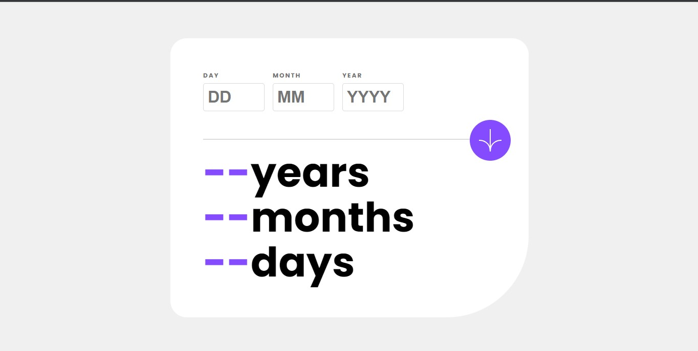

# Frontend Mentor - Age calculator app solution

## Table of contents

- [Overview](#overview)
  - [The challenge](#the-challenge)
  - [Screenshot](#screenshot)
- [My process](#my-process)
  - [Built with](#built-with)
  - [What I learned](#what-i-learned)
  - [Continued development](#continued-development)
  - [Useful resources](#useful-resources)
- [Author](#author)

## Overview

### The challenge

Users should be able to:

- View an age in years, months, and days after submitting a valid date through the form
- Receive validation errors if:
  - Any field is empty when the form is submitted
  - The day number is not between 1-31
  - The month number is not between 1-12
  - The year is in the future
  - The date is invalid e.g. 31/04/1991 (there are 30 days in April)
- View the optimal layout for the interface depending on their device's screen size
- See hover and focus states for all interactive elements on the page
- **Bonus**: See the age numbers animate to their final number when the form is submitted

### Screenshot



## My process

### Built with

- BEM
- Flexbox
- CSS Grid
- Semantic HTML5 markup
- CSS custom properties
- Mobile-first workflow
- Accessibility in mind

### What I learned

```js
function animate(elt, endNbr) {
  incNbrRec(0, endNbr, elt);
}

/*A recursive function to increase the number.*/
function incNbrRec(i, endNbr, elt) {
  if (i <= endNbr) {
    elt.textContent = i;
    setTimeout(function () {
      //Delay a bit before calling the function again.
      incNbrRec(i + 1, endNbr, elt);
    }, speed);
  }
}
```

### Continued development

Css and JS Animations

### Useful resources

- [Date fns documentation](https://www.date-fns.org/docs) - This is a library from npm website which helped me with the date calculation.

- [Snowpack documentation](https://www.snowpack.dev) - This is a build tool I used for bundling my files.

- [Geekflare](https://geekflare.com/javascript-date-fns/) - This website saved me a lot of frustration.

## Author

- Website - [George Asiedu](https://www.georgeasiedu.tech)
- Frontend Mentor - [@george5-star](https://www.frontendmentor.io/profile/geoge5-star)
- Twitter - [@george5_star](https://www.twitter.com/geoge5_star)
